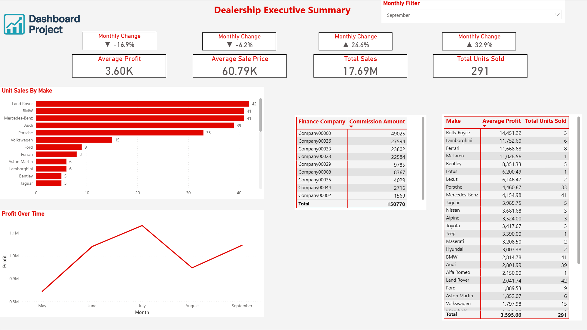
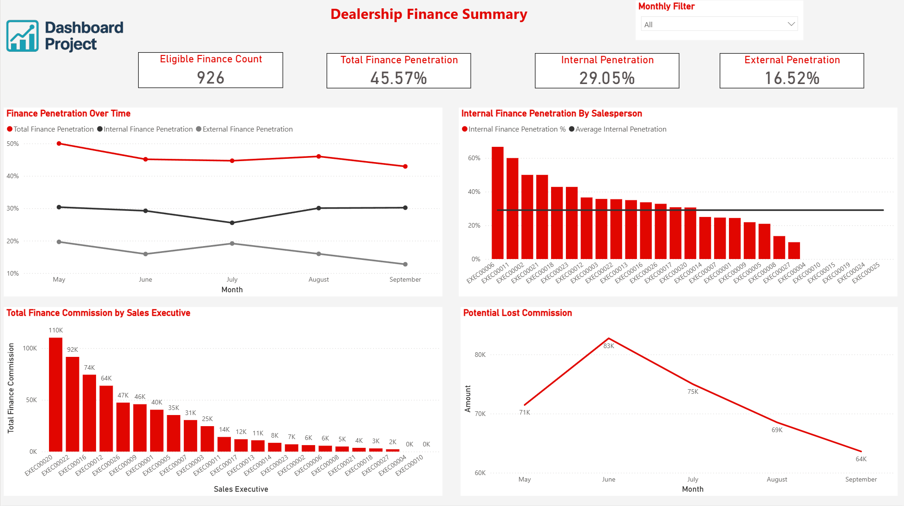
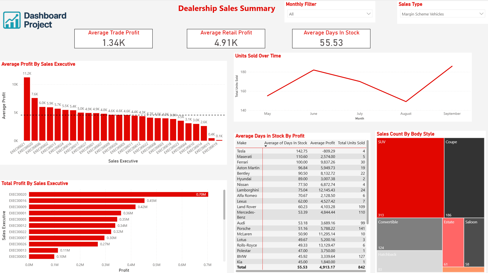

# Used Car Sales Data Report

## Overview
This project showcases a **Power BI dashboard** analysing used car sales and finance performance.  
All data has been **anonymised** to protect privacy while maintaining realistic structures for reporting.  
The project includes Python scripts for data cleaning, CSV datasets, and a custom Power BI theme for consistent visual styling.

---

## Dataset
- The dataset is **anonymised**, with no personally identifiable information.  
- Any IDs (e.g., customers, invoices, stock numbers) have been replaced.

---

## Features
- **Interactive Power BI dashboard** with Executive, Finance, and Sales summary pages.  
- **Anonymised datasets** for finance and sales analysis.  
- **Python scripts** for cleaning repetitive CSVs.  
- **Custom Power BI theme** for professional visuals.

---

### Dashboard Previews
  
  


---

## How to Use
1. Open the `.pbix` file in Power BI Desktop.  
2. Explore the dashboard using the provided slicers and filters.  
3. Review the metrics and visualisations for insights into anonymised sales and finance data.

---

## Folder Structure

```plaintext
Used_Car_Sales_Data_Report/
├── Dashboard_Screenshots/
│   ├── Executive_Summary.png
│   ├── Finance_Summary.png
│   └── Sales_Summary.png
├── New_Finance_Reports/
│   └── Finance_Combined.csv
├── Python_Test_Scripts/
│   ├── Finance_Comms_Cleaning/
│   │   ├── Clean_Finance.py
│   │   └── Clean_Finance.txt
│   └── Sales_Report_Cleaning/
│       ├── Clean_CSV.py
│       └── Clean_CSV.txt
├── Sales_Report/
│   └── Sales_Combined.csv
├── Used_Car_Report.pbix
├── Used_Car_Theme.json
└── README.md
